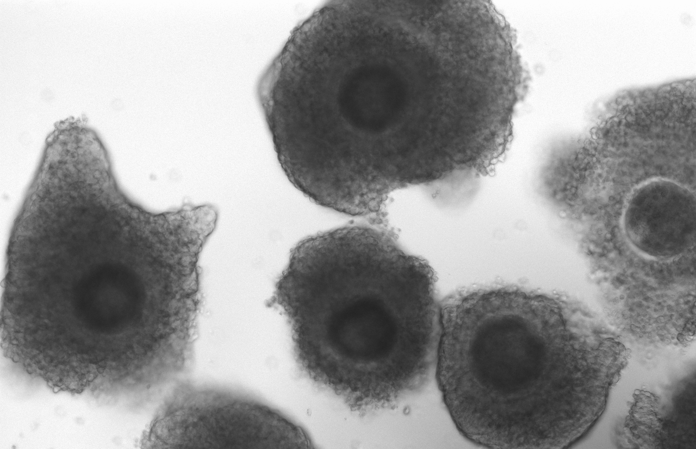

```{css, echo=FALSE}
h1, h4 {
  text-align: center;
}
```

<style>
div.blue { background-color:#ebebff; border-radius: 5px; padding: 20px;}
</style>
<div class = "blue">
Our mission is to understand the molecular mechanisms that drive fertility and the early stages of embryo development and implantation in mammals. To achieve our goals, we are strongly committed to combining experimental, and systems genomics approaches to understand the dynamics of gene regulatory and signaling networks that orchestrate successful events related to fertility or infertility. Our efforts focus on three primary thrusts: 1) Molecular profiling of heifer infertility; 2) The acquisition of developmental competence in oocytes and the molecular signals of embryo survival; 3) Molecular communication between conceptus and endometrium.
</div>

<br>

<style>
div.blue { background-color:#ebebff; border-radius: 5px; padding: 20px;}
</style>
<div class = "blue">
**Our research program is partially funded by:**

**- The United States Department of Agriculture** <br>

*  <span style="color:blue">NIFA 2024-38420-41540 - Bridging Genomes to Phenomes: Fostering interdisciplinary expertise to advance animal production</span>
*  <span style="color:blue">NIFA 2020-67015-31616 - Identification of gene expression profiles in peripheral white blood cells predictive of heifer pregnancy success</span>

**- Virginia Agriculture council** <br>

*  <span style="color:blue">Selection of High Competence Cattle Embryos by Video Analysis</span>
*  <span style="color:blue">Identification of Plasma Proteins That Can Be Used to Reduce the Economic Impact of Infertility in Beef Heifers</span>
</div>
</div>

# Research {#research}

## Molecular profiling of heifer infertility
<div class = "row">
<div class = "col-md-6">
There are several causes infertility. In the Biase Lab, we are tackling the problem in heifers in beef and dairy cattle. Our multidisciplinary program aims at profiling blood born molecules for the comprehensive investigation of genetic and physiological alterations that contribute to infertility. Then, we employ artificial intelligence algorithms for the prediction of fertility heifers early as early as 6 months of age.
</div>

<div class = "col-md-6">
<p style="text-align:center;">

</p>
</div>
</div>


## The acquisition of developmental competence in oocytes

<div class = "row">

<div class = "col-md-6">
<p style="text-align:center;">

</p>
</div>


<div class = "col-md-6">
The female gamete stores massive amounts of RNAs, proteins and metabolites. The qualitative and quantitative composition of these stores define the ability of this oocyte to be fertilized and sustain the early embryo development. We are interested in understanding the regulatory venues that drive the synthesis of RNA in oocytes. Furthermore, we focus on unveiling how the accumulation of RNAs will contribute to the oocyte developmental competence.
</div>


</div>


## Early stages of mammalian development
<div class = "row">
<div class = "col-md-6">
The initial cell cycles of the mammalian organisms are an intriguing, and amazing, phase of the development. The development of a complex multicellular organism from one cell (also called zygote) is far from being understood by developmental biologists. In our lab, we are researching the gene regulatory network wiring that allows the embryo to successfully reach the blastocyst stage. First, we are interested in understanding how the embryo’s genome is activated. Then, we are investigating how the cells (also called blastomeres) differentiate towards two distinct cell types, forming the inner cell mass and the trophectoderm.
</div>

<div class = "col-md-6">
<p style="text-align:center;">

</p>
</div>
</div>


## Conceptus-maternal communication
<div class = "row">
<div class = "col-md-6">
pict
</div>

<div class = "col-md-6">
 After the formation of blastocyst, the embryos hatch from the zona pelucida and the embryonic cells are in immediate contact with the endometrial cells in the uterus. Then, a two-way molecular communication takes place so that the embryo is not rejected by the endometrium and is nourished by the uterus. This communication is essential for the successful implantation and subsequent placentation. We are interested in finding the multitude of pathways the conceptus uses communicates with the endometrium and vice-versa.
</div>
</div>


<br>
<a href="#top">Back to top</a>

---

# Team {#team}

<div class = "row">
  
<div class = "col-md-3">

<br>
Fernando Biase
<br>
[CV](https://drive.google.com/file/d/1E1Xgi0vmKZzCDdsf8h6DzZ-rWtcPqp6g/view?usp=sharing)
</div>


<div class = "col-md-3">
<br> <br> <br> <br>
Mackenzie Marrella
</div>

<div class = "col-md-3">
<br> <br> <br> <br>
Gustavo Schettini
</div>


 <div class = "col-md-3">
<br><br>

</div>


</div>

<br>
<br>

### Former lab members and their next endeavors

Jada Nix - MS 2023 - Doctoral program at Universty of Missouri<br>
Bailey Walker - MS 2020 - Embryologist and Laboratory Technician at Alabama Center for Reproductive Medicine<br>
[Sarah E Moorey](https://utia.tennessee.edu/person/?id=16565) - PhD 2019 - Assistant Professor at University of Tennessee <br>
Katelyn Kimble  - MS 2018 - Texas A&M College of Veterinary Medicine & Biomedical Sciences <br>
 
<br>
<a href="#top">Back to top</a>

---

# Publications {#publications}

**For a complete list of publications, please visit [Pubmed](https://www.ncbi.nlm.nih.gov/myncbi/10MMNWmxoMt/bibliography/public/) or [Google Scholar](https://scholar.google.com/citations?hl=en&user=iG8M1p8AAAAJ&view_op=list_works&sortby=pubdate). BioRxiv papers can be loaded using [bioRxiv](https://www.biorxiv.org/search/author1%3Afernando%2Bbiase%20jcode%3Abiorxiv%20numresults%3A10%20sort%3Arelevance-rank%20format_result%3Astandard)**

2020-current
<style>
div.lightgray { background-color:#F5F5F5; border-radius: 5px; padding: 20px;}
</style>
<div class = "lightgray">

Nix JL, Schettini GP, Speckhart SL, Ealy AD, Biase FH. Ablation of <i>OCT4</i> function in cattle embryos by double electroporation of CRISPR-Cas for DNA and RNA targeting (CRISPR-DART). PNAS Nexus. 2023 Oct 20;2(11):pgad343. doi: 10.1093/pnasnexus/pgad343. [Paper](https://academic.oup.com/pnasnexus/article/2/11/pgad343/7325962)

Biase FH, Moorey SE, Schnuelle JG, Rodning S, Ortega MS, Spencer TE. Extensive rewiring of the gene regulatory interactions between in vitro-produced conceptuses and endometrium during attachment. PNAS Nexus. 2023 Sep 2;2(9):pgad284. doi: 10.1093/pnasnexus/pgad284.[Paper](https://academic.oup.com/pnasnexus/article/2/9/pgad284/7258995?searchresult=1)

Marrella MA, Biase FH. A multi-omics analysis identifies molecular features associated with fertility in heifers (Bos taurus). Sci Rep. 2023 Aug 4;13(1):12664. doi: 10.1038/s41598-023-39858-0. [Paper](https://www.nature.com/articles/s41598-023-39858-0#:~:text=Our%20multi%2Domics%20analyses%20confirm,of%20breed%2Dspecific%20genetic%20background.)

Marrella MA, Biase FH. Robust identification of regulatory variants (eQTLs) using a differential expression framework developed for RNA-sequencing. J Anim Sci Biotechnol. 2023 May 5;14(1):62. doi:   10.1186/s40104-023-00861-0. [Paper](https://jasbsci.biomedcentral.com/articles/10.1186/s40104-023-00861-0)

Nix JL, Schettini GP, Biase FH. Sexing of cattle embryos using RNA-sequencing data or polymerase chain reaction based on a complete sequence of cattle chromosome Y. Front Genet. 2023 Apr 3;14:1038291. doi: 10.3389/fgene.2023.1038291. [Paper](https://www.frontiersin.org/articles/10.3389/fgene.2023.1038291/full)

Nix J, Marrella MA, Oliver MA, Rhoads M, Ealy AD, Biase FH. Cleavage kinetics is a better indicator of embryonic developmental competency than brilliant cresyl blue staining of oocytes. Anim Reprod Sci. 2023 Jan;248:107174. doi:10.1016/j.anireprosci.2022.107174. [Paper](https://www.sciencedirect.com/science/article/abs/pii/S0378432022002536?via%3Dihub)

Wilson C, Dias NW, Pancini S, Mercadante V, Biase FH. Delayed processing of blood samples impairs the accuracy of mRNA-based biomarkers. Sci Rep. 2022 May 17;12(1):8196. doi: 10.1038/s41598-022-12178-5. [Paper](https://www.nature.com/articles/s41598-022-12178-5)

Biase FH. Isolation of high-quality total RNA and RNA sequencing of single bovine oocytes. STAR Protocols. 2021; 2(4).https://doi.org/10.1016/j.xpro.2021.100895. [PDF](https://hivebench-star-protocols.s3.amazonaws.com/protocols/1108.pdf)

Moorey SE, Walker BN, Elmore MF, Elmore JB, Rodning SP, Biase FH. Rewiring of gene expression in circulating white blood cells is associated with pregnancy outcome in heifers (Bos taurus). Sci Rep. 2020 Oct 8;10(1):16786. doi: 10.1038/s41598-020-73694-w. [PDF](https://www.nature.com/articles/s41598-020-73694-w.pdf)

Moorey SE, Biase FH. Beef heifer fertility: importance of management practices and technological advancements. J Anim Sci Biotechnol. 2020 Oct 1;11:97. doi: 10.1186/s40104-020-00503-9. [PDF](https://jasbsci.biomedcentral.com/track/pdf/10.1186/s40104-020-00503-9)

Walker BN, Biase FH. The blueprint of RNA storages relative to oocyte developmental competence in cattle (Bos taurus). Biol Reprod. 2020 Apr 15;102(4):784-794. doi: 10.1093/biolre/ioaa015. [abstract](https://academic.oup.com/biolreprod/article-abstract/102/4/784/5715793?redirectedFrom=fulltext)

</div>


<br>
<a href="#top">Back to top</a>

---

# Join us {#joinus}

We look forward to having new team members joining our laboratory to work on a multidisciplinary research program that encompasses the disciplines of Reproductive and Developmental Biology, Molecular Genetics, Genomics and Computational Biology. 
<br>

***Enthusiastic and goal-oriented researchers who are interested in strengthening their training and developing skills that will help them progress in their career are encouraged to contact us.*** **Prospective graduate students may also choose to be part of the [Molecular and Cellular Biology](https://mcb.vt.edu/) or [Genetics, Bioinformatics, and Computational Biology](https://gbcb.graduateschool.vt.edu/) programs.**

If you are interested in joining our research program, please send an email to ***fbiase*** @ ***vt.edu***.

<br>


<div class = "row">
<div class = "col-md-6">

Our lab is located at 175 W Campus Dr, Blacksburg, VA 24061

```{r, echo=FALSE, fig.height=4, fig.width=6}
library('leaflet')
leaflet() %>%
   addTiles %>% 
   addMarkers( lat= 37.221711,  lng= -80.423774, popup="Litton-Reaves Hall")
```

</div>

<div class = "col-md-6">

We have great facilities that allow us to advance our research.

<iframe src="https://docs.google.com/presentation/d/1EkOP0e1CKDgsTE98-Z1e_a0X_VfZ74kb3kFozv5Kdfo/embed?start=true&loop=true&delayms=3000" frameborder="0" width="560" height="379" allowfullscreen="true" mozallowfullscreen="true" webkitallowfullscreen="true"></iframe>
</div>
</div>

<br>
<a href="#top">Back to top</a>


---

# In the news {#news}

[Contemporary and Emerging Issues Symposium I](https://www.asas.org/taking-stock/blog-post/taking-stock/2021/07/18/contemporary-and-emerging-issues-symposium-i) <br> from ASAS Taking Stock blog post, Published on July 18, 2021
<br>

"Dr. Fernando Biase spoke about “Grand Challenges within Breeding and Genetics”"
<br>

[Predicting cattle infertility through machine-learning](https://vtnews.vt.edu/articles/2020/08/predicting-cattle-infertility.html) <br> by Max Esterhuizen, Published on September 15, 2020
<br>

"Fernando Biase and the other researchers are working to understand the potential gene transcripts that circulate in the animal’s bloodstream that can potentially predict the likelihood of a pregnancy occurring, with the goal of finding out how early these transcripts can be identified in a calf."
<br>

[Auburn University researcher working to improve fertility in cattle](https://ocm.auburn.edu/newsroom/news_articles/2019/07/101355-improving-cattle-fertility.php) <br> by Paul Hollis, Published on July 10, 2019


<br>
<a href="#top">Back to top</a>

